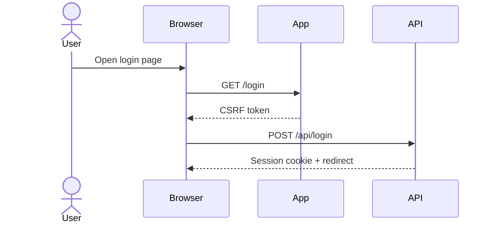

# Flow: {flow name}

## Summary
- **Domain**: https://target.example
- **Flow Type**: login
- **Entry Point**: `GET /login`
- **Outcome**: Authenticated session established

## Auth Requirements
- Anonymous or authenticated
- Required role, tenant, or account state
- MFA, captcha, email verification, or invite dependencies

## Session And CSRF
- Session cookies
- CSRF tokens
- Other required headers or signed values

## Endpoints Involved
- `GET /login`
- `POST /api/login`
- `GET /dashboard`

## Request Sequence
1. `GET /login` returns HTML and CSRF token.
2. `POST /api/login` sends credentials and CSRF token.
3. `302 /dashboard` sets the authenticated session.

## Sequence Diagram

## Data Model
- Credential fields, cart IDs, profile IDs, order IDs, recovery tokens, payment intents, or other objects observed

## State Transitions
- Anonymous -> login form loaded
- Login submitted -> session issued
- Session issued -> dashboard accessible

## Replication Notes
- Exact request order to replay
- Values that must be freshly captured
- Requests another agent can skip without breaking the flow
- Known failure branches, retries, and timing constraints

## Open Questions
- Missing API calls, hidden branches, or unconfirmed dependencies
