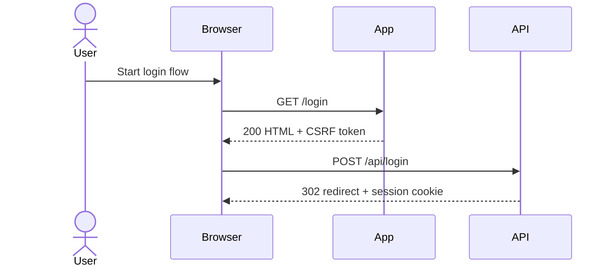
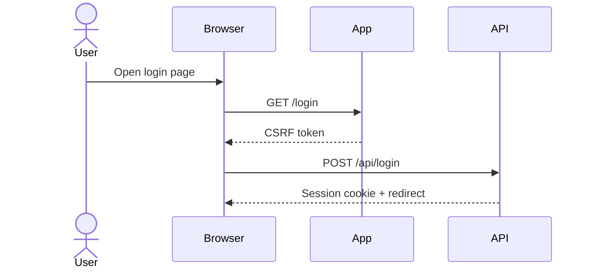

# Mental Map Playbook

## Overview

Use this as a decision tree: connect to Kaido MCP, capture a real user journey through the proxy, cluster the requests into one business flow, identify the state transitions and dependencies, then write a markdown sequence diagram another agent can replay without rediscovering the workflow.

## Decision Tree

1. Set the browser or HTTP client proxy to `KAIDO_MCP_PROXY_URL`.
2. Capture one real application journey at a time.
3. Group requests into a named flow such as `login`, `forgot-password`, `cart`, or `checkout`.
4. Remove noise, then keep only requests that advance state, fetch prerequisites, or establish session context.
5. Record the sequence, auth requirements, tokens, and data objects.
6. Save the flow map under `application-structure/{flow-type}/`.

## 1. Connect To Kaido MCP

Goal: make sure the traffic you analyze reflects a real browser session and complete request chain.

### Configure

- Set the browser, interceptor, or replay client proxy to `KAIDO_MCP_PROXY_URL`.
- Use one scoped target at a time.
- Capture full headers, cookies, response codes, redirects, and bodies where safe.
- Preserve request order so redirects, token minting, and state transitions remain visible.

### Record

- Host and scheme
- Auth state before starting the flow
- Account role used
- Whether MFA, email verification, invite links, or captchas affected the path

## 2. Filter And Group Requests By Flow

Goal: turn noisy proxy traffic into a stable, named workflow.

### Grouping Signals

- Navigation path and referring page
- Shared session or CSRF token lifecycle
- Endpoint naming patterns such as `/login`, `/cart`, `/checkout`, `/profile`
- Request timing and redirect chains
- Shared object identifiers such as cart ID, order ID, user ID, reset token, or payment intent

### Keep

- Entry-point requests
- State-changing operations
- Token/bootstrap requests required for later steps
- Validation or preflight requests that gate the action
- Final confirmation or status-check requests

### Drop

- Static assets
- Duplicate polling unless it changes state understanding
- Analytics and third-party beacons
- Irrelevant background refresh traffic

## 3. Identify Entry Points, State Changes, And Dependencies

For each grouped flow, answer:

- What starts the flow
- Which request first requires authentication
- Which request changes server-side state
- Which tokens, IDs, headers, or cookies are minted and consumed
- Which previous request is a hard prerequisite for the next one
- Which branch conditions exist for success, failure, retry, or step-up auth

### Dependencies To Call Out

- CSRF token fetches
- Session bootstrap endpoints
- Feature-flag or config fetches
- Cart, order, invoice, profile, or recovery identifiers
- Signed URLs, nonce values, OTP challenges, or one-time reset links

## 4. Build Sequence Diagrams In Markdown

Write each flow as a markdown document with a mermaid sequence diagram plus structured notes.

### Diagram Rules

- Use the real domain and normalized endpoint paths
- Keep actors simple: `User`, `Browser`, `App`, `API`, `IdP`, `Payment Provider`
- Number the major steps in surrounding prose if the diagram alone is not enough
- Annotate redirects, token issuance, and state transitions inline

### Suggested Diagram Skeleton



## 5. Document Auth, Session Handling, And CSRF

Every flow file must capture:

- Whether the flow is anonymous, partially authenticated, or fully authenticated
- Required roles or account conditions
- Session cookie names and where they first appear
- CSRF token names, where they are issued, and where they are required
- Whether the app uses `Origin`, `Referer`, custom headers, or signed requests
- Whether step-up auth, MFA, email links, or captchas interrupt replay

## 6. Store In Application Structure

Write the output to:

`$HARNESS_SHARED_BASE/{program}/agent_shared/application-structure/{flow-type}/{flow-name}.md`

Use the closest existing `flow-type` directory:

- `auth`
- `signup`
- `login`
- `forgot-password`
- `user-profile`
- `cart`
- `checkout`
- `other`

Create a new normalized flow-type directory only when the existing set would hide an important business area.

## Flow File Template

Each flow file should include:

````markdown
# Flow: {flow name}

## Summary
- **Domain**: https://target.example
- **Flow Type**: login
- **Entry Point**: `GET /login`
- **Outcome**: Authenticated session established

## Auth Requirements
- Anonymous or authenticated
- Required role, tenant, or account state
- MFA, captcha, email verification, or invite dependencies

## Session And CSRF
- Session cookies
- CSRF tokens
- Other required headers or signed values

## Endpoints Involved
- `GET /login`
- `POST /api/login`
- `GET /dashboard`

## Request Sequence
1. `GET /login` returns HTML and CSRF token.
2. `POST /api/login` sends credentials and CSRF token.
3. `302 /dashboard` sets the authenticated session.

## Sequence Diagram


## Data Model
- Credential fields, cart IDs, profile IDs, order IDs, recovery tokens, payment intents, or other objects observed

## State Transitions
- Anonymous -> login form loaded
- Login submitted -> session issued
- Session issued -> dashboard accessible

## Replication Notes
- Exact request order to replay
- Values that must be freshly captured
- Requests another agent can skip without breaking the flow
- Known failure branches, retries, and timing constraints

## Open Questions
- Missing API calls, hidden branches, or unconfirmed dependencies
````

## 7. Escalate Useful Follow-On Work

Update shared notes when the map creates a concrete next step for another skill, for example:

- CSRF review on a state-changing form
- IDOR review on object IDs carried through the flow
- Race review on multi-step checkout or reset paths
- SSRF, XSS, or SQLi review on newly mapped endpoints
